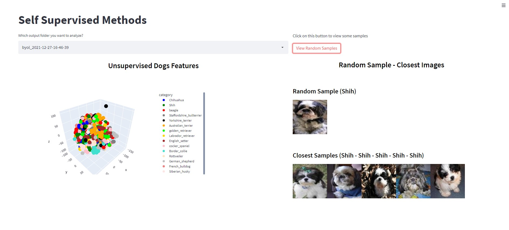

# **Self Supervised Methods Comparison**

## **Bootstrap Your Own Latent (BYOL) - PyTorch**

<p align="center">
    </img>
</p>

PyTorch implementation of <a href="https://arxiv.org/abs/2006.07733">BYOL</a> method for self-supervised learning for <a href="https://cs.stanford.edu/~acoates/stl10/"> STL10 Dataset</a>, <a href="https://www.kaggle.com/michaelfumery/unlabeled-stanford-dags-dataset"> Dogs Dataset </a>, or <a href="https://www.cs.toronto.edu/~kriz/cifar.html"> CIFAR10 Dataset </a>.


### **Dogs Dataset**

* Download dataset from kaggle (<a href="https://www.kaggle.com/michaelfumery/unlabeled-stanford-dags-dataset"> Dogs Dataset </a>)
* Create a *data/dogs* folder structure in the project directory
* Put train, test, and list_breeds.csv into data/dogs directory
* Resize all dataset images in a square format (e.g. 96x96) to speed up the training process

You can use the following code in a custom script:
```
import os
from tqdm import tqdm
from PIL import Image
from glob2 import glob

data_path = "data/dogs"
files = [f for f in glob(os.path.join(data_path, "*", "*.jpg"))]
for fpath in tqdm(files, total=len(files)):
    im = Image.open(fpath).resize(size=(96, 96))
    im.save(fpath)
```


### **Usage**

Set your training params in *hp/BYOL/hp.yml* file. You can change dataset (STL10/dogs/CIFAR10), model backbone and training params (epochs, lr, scheduler, etc.). 

Once your params are ready, run the training script:

```
python train.py --model byol
```
During training, encoder will be saved as pth file.

To extract features from your validation dataset, run the inference script by specifying weights path.:
```
python inference.py --model byol --weights checkpoints/byol/byol_2021-12-19-11-35-51/byol_resnet18_epoch_2_loss_0.1236.pth --params checkpoints/byol/byol_2021-12-19-11-35-51/hp.yml
```

The inference script will save features, labels, and tsne_features in an output folder.

### **WebApp Visualization**

Before running the visualization webapp, you must generate the images for the STL10 and the CIFAR10 dataset. To do so, run the scripts in *support* folder (*stl10.py* and *cifar10.py*). They will generate images of the test dataset into *data* folder.


You can visualize TSNE features distribution as well as some samples with <a href="https://streamlit.io">streamlit</a>. To run the visualization webapp:

```
streamlit run frontend/webapp.py
```
You need to select the features folder and then the webapp will display the features distribution. You can also interact with the 3D graph (e.g. zooming in/out, selecting categories to show, etc.). 

By clicking on "View Random Samples" button the webapp will show a sample and the closest 5 images based on the features extracted by the model.

<p align="center">
    </img>
</p>


### **To-Do List**


[ ] Fix Custom Random ColorJitter and GaussianBlur transformations 

[ ] Tensorboard integration

[ ] GradCAM image visualization

[ ] DINO


