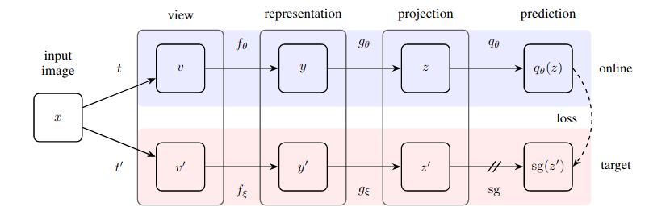
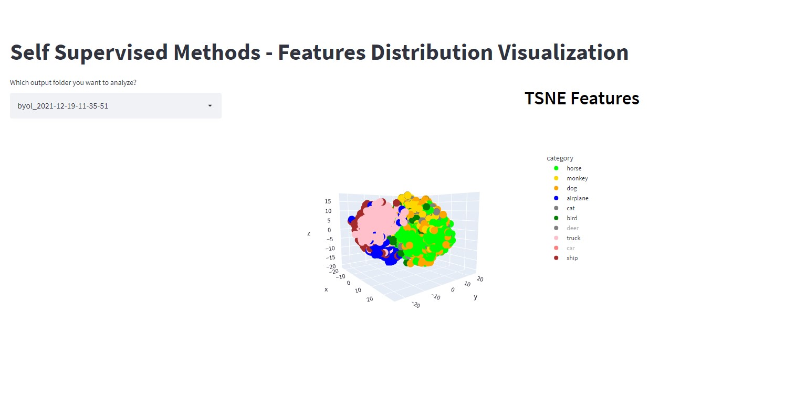

# **Self Supervised Methods Comparison**

## **Bootstrap Your Own Latent (BYOL) - PyTorch**

<p align="center">
    </img>
</p>

PyTorch implementation of <a href="https://arxiv.org/abs/2006.07733">BYOL</a> method for self-supervised learning based on either  <a href="https://cs.stanford.edu/~acoates/stl10/"> STL10 Dataset</a> or <a href="https://www.kaggle.com/michaelfumery/unlabeled-stanford-dags-dataset"> Dogs Dataset </a>.

### **Usage**

Set your training params in *hp/BYOL/hp.yml* file. You can change dataset (STL10/dogs), model backbone and training params (epochs, lr, scheduler, etc.). 

Once your params are ready, run the training script:

```
python train.py --model byol
```
During training, encoder will be saved as pth file.

To extract features from your validation dataset, run the inference script by specifying weights path:
```
python inference.py --model byol --weights checkpoints/byol/byol_2021-12-19-11-35-51/byol_resnet18_epoch_2_loss_0.1236.pth
```
The inference script will save features, labels, and tsne_features in an output folder.

### **Feature Distribution Visualization**

You can visualize TSNE features distribution with <a href="https://streamlit.io">streamlit</a>. To run the visualization webapp:

```
streamlit run frontend/webapp.py
```
You need to select the features folder and then the webapp will display the features distribution. You can also interact with the 3D graph (e.g. zooming in/out, selecting categories to show, etc.)

<p align="center">
    </img>
</p>


### **To-Do List**


[ ] Fix Custom Random ColorJitter and GaussianBlur transformations 

[ x ] Unsupervised Dog Dataset (https://www.kaggle.com/michaelfumery/unlabeled-stanford-dags-dataset)

[ x ] Webapp visualization with Dogs Dataset (dynamic loading of categories based on dataset name)

[ ] Tensorboard integration

[ ] GradCAM image visualization

[ x ] core/train+test as general as possible

[ ] DINO


